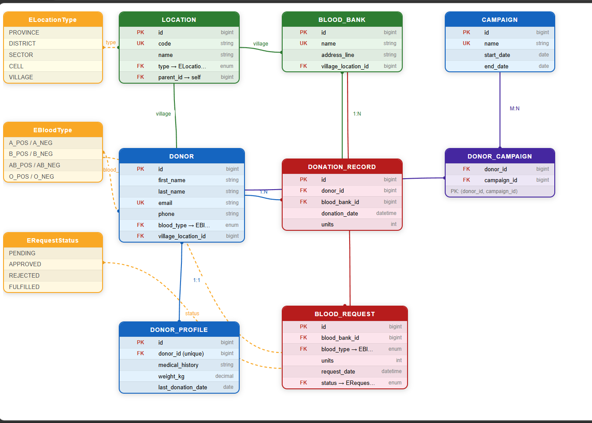
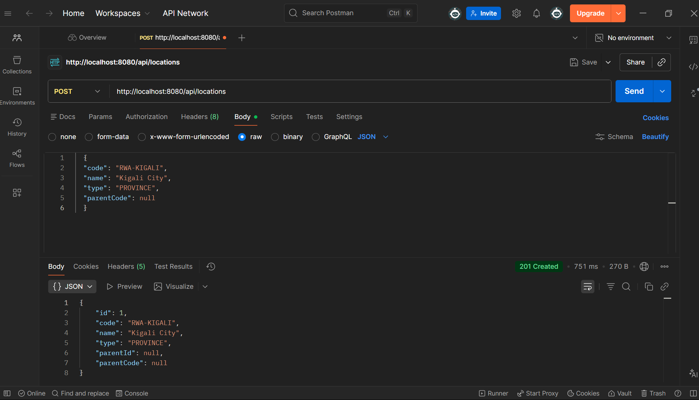
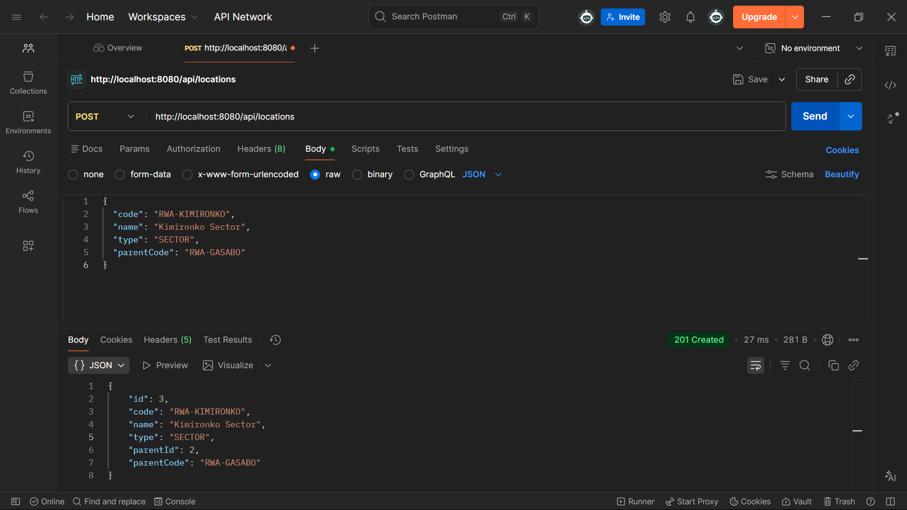
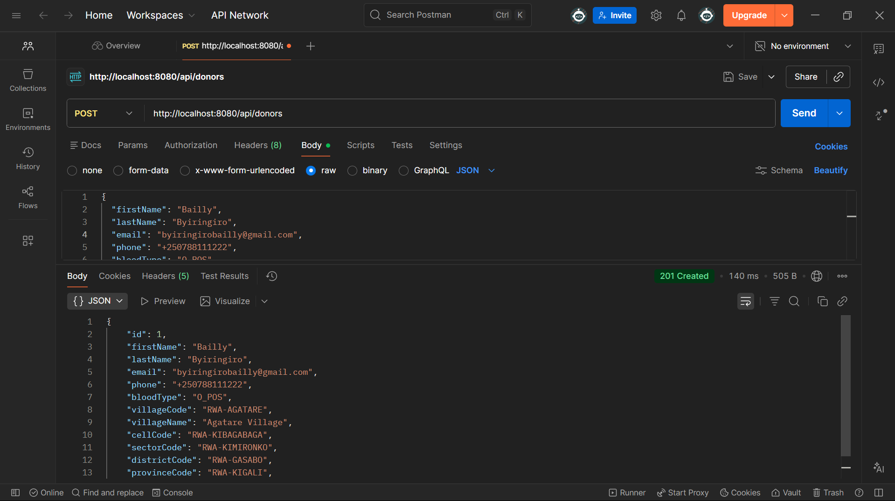
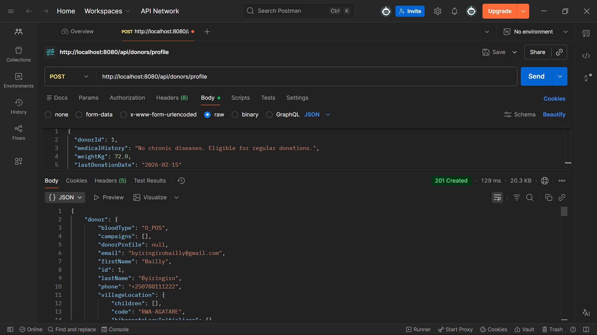
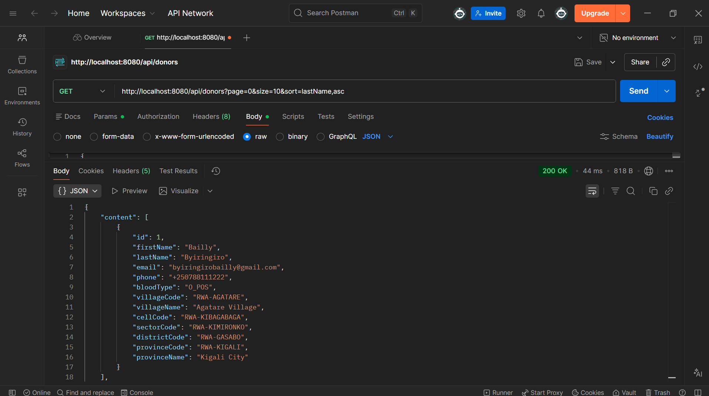
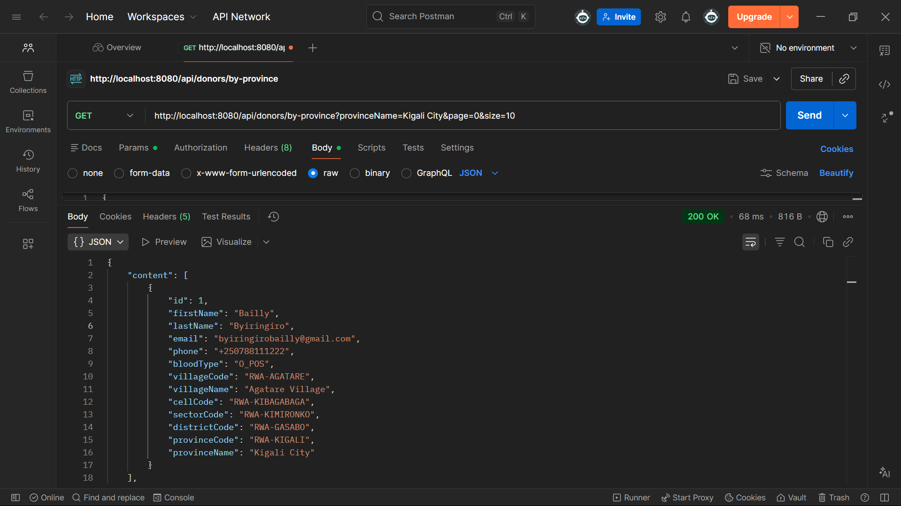
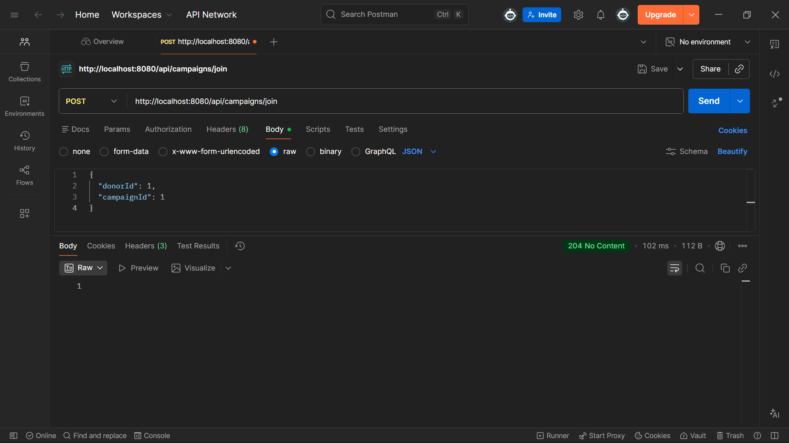
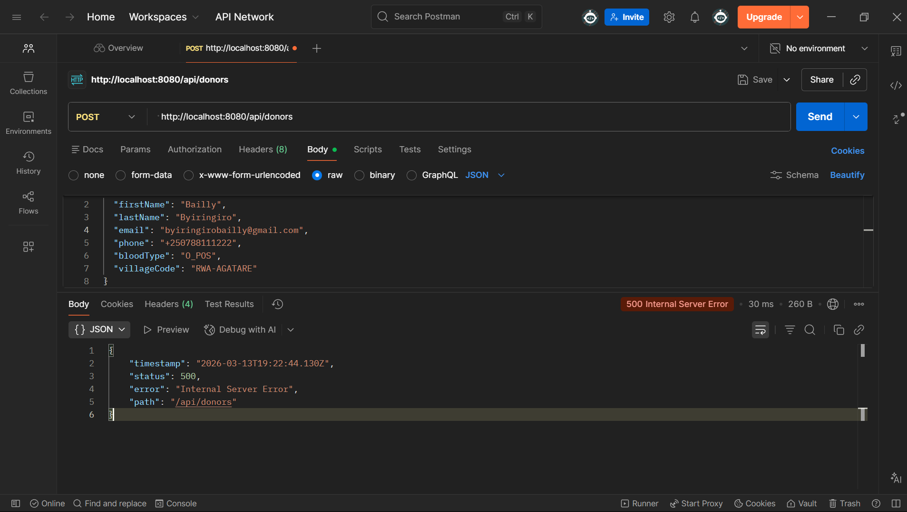
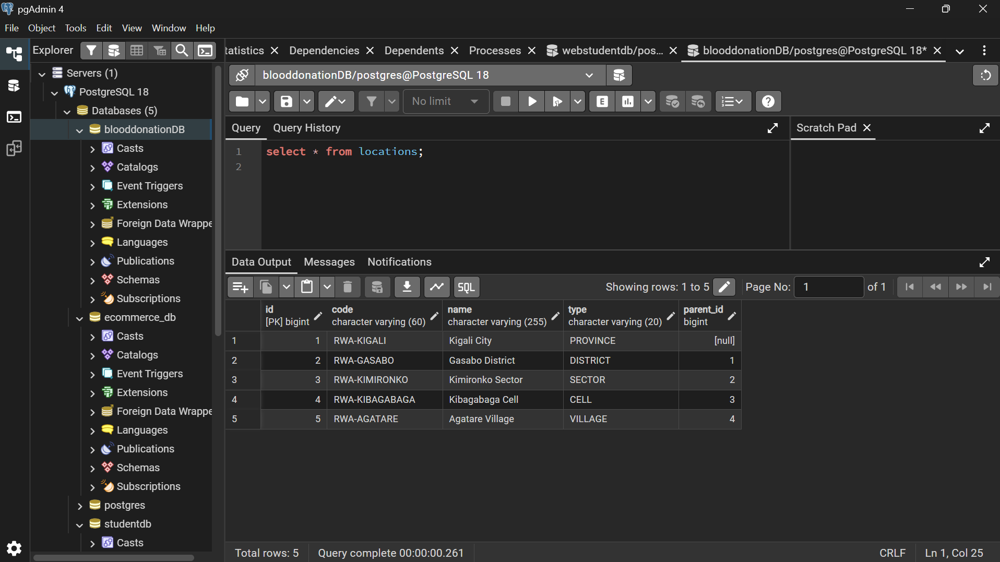

## Project Description

This project is a **Spring Boot REST API** for a **Blood Donation Management System**.  
It manages donors, blood banks, donation records, blood requests, campaigns, and a full **Rwanda location hierarchy** (Province → District → Sector → Cell → Village) using a single, flexible `locations` table.

Main goals:

- Centralize all blood‑donation–related data behind a clean REST API.
- Enforce correct relationships between entities (especially the location chain).
- Allow **users to set their location only by Village**, while the system automatically links that Village to Cell, Sector, District, and Province via parent relations.
- Support **pagination, sorting, validation, and duplicate checks** using Spring Data JPA and Bean Validation.

---

## Project Overview

### Tech Stack

- **Language**: Java 17  
- **Framework**: Spring Boot 4.x  
- **Persistence**: Spring Data JPA (Hibernate) + PostgreSQL  
- **Build Tool**: Maven  
- **Validation**: Jakarta Bean Validation (`@NotBlank`, `@Email`, `@NotNull`, `@Min`, etc.)

### High‑Level Features

- REST endpoints for:
  - **Locations**: single `Location` model with type `PROVINCE`, `DISTRICT`, `SECTOR`, `CELL`, `VILLAGE`
  - **Donors** and their medical profiles (`DonorProfile`)
  - **Blood banks**
  - **Donation records**
  - **Blood requests**
  - **Campaigns**
- Users register **only with a Village location code**, and the system derives Cell/Sector/District/Province from the `parent` chain.
- Pagination and sorting for donors and donation records.
- `existsBy...` methods to enforce uniqueness (emails, codes, names).
- Global error handling with structured JSON responses.

---

## Architecture

### Layered Structure

Base package: `blooddonation.com.BloodDonation`

- **`controller`**
  - REST controllers (`@RestController`)
  - `controller.dto` – DTO classes for requests and responses (e.g. `CreateDonorRequest`, `LocationDto`)
  - `RestExceptionHandler` – global exception handler returning consistent error JSON
- **`service`**
  - Business logic (`@Service`)
  - Transactional methods (`@Transactional`)
  - Maps entities ⇆ DTOs and enforces business rules
- **`repository`**
  - Spring Data JPA interfaces (`extends JpaRepository`)
  - Derived query methods like `existsByEmail`, `findByType`, `findByProvinceCodeOrName`, etc.
- **`domain`**
  - JPA entities and enums that map directly to database tables (e.g. `Location`, `Donor`, `EBloodType`, `ERequestStatus`)

**Request flow**:  
Client → Controller (DTO) → Service (logic) → Repository (DB) → Service (map to DTO) → Controller → Client.


---

## Database Design

### Location Model (Rwanda Hierarchy via Single Table)

All administrative levels are stored in one table:

- **Location**
  - Table: `locations`
  - Columns:
    - `id` (PK)
    - `code` (unique, e.g. `RWA-KIGALI`, `RWA-GASABO`, `RWA-AGATARE`)
    - `name` (e.g. `Kigali City`, `Gasabo District`, `Agatare Village`)
    - `type` (enum `ELocationType`: `PROVINCE`, `DISTRICT`, `SECTOR`, `CELL`, `VILLAGE`)
    - `parent_id` (nullable FK → `locations.id`)
  - Examples:
    - Province row: `type = PROVINCE`, `parent_id = null`
    - District row: `type = DISTRICT`, `parent_id = <province id>`
    - Sector row: `type = SECTOR`, `parent_id = <district id>`
    - Cell row: `type = CELL`, `parent_id = <sector id>`
    - Village row: `type = VILLAGE`, `parent_id = <cell id>`

This ensures each **Village** belongs to exactly one Province → District → Sector → Cell chain through the `parent_id` relationships.

### Core Business Tables

- **Donor**
  - Table: `donor`
  - Columns:
    - `id`
    - `first_name`, `last_name`
    - `email` (unique)
    - `phone`
    - `blood_type` (enum `EBloodType`: `A_POS`, `A_NEG`, `B_POS`, `B_NEG`, `AB_POS`, `AB_NEG`, `O_POS`, `O_NEG`)
    - `village_location_id` (FK → `locations.id` where `type = VILLAGE`)
- **DonorProfile** (one‑to‑one with Donor)
  - Table: `donor_profile`
  - Columns: `id`, `donor_id` (unique FK), `medical_history`, `weight_kg`, `last_donation_date`
- **BloodBank**
  - Table: `blood_bank`
  - Columns:
    - `id`
    - `name` (unique)
    - `address_line`
    - `village_location_id` (FK → `locations.id` where `type = VILLAGE`)
- **DonationRecord**
  - Table: `donation_record`
  - Columns:
    - `id`
    - `donor_id` (FK → `donor.id`)
    - `blood_bank_id` (FK → `blood_bank.id`)
    - `donation_date`
    - `units`
- **BloodRequest**
  - Table: `blood_request`
  - Columns:
    - `id`
    - `blood_bank_id` (FK → `blood_bank.id`)
    - `blood_type` (enum `EBloodType`)
    - `units`
    - `request_date`
    - `status` (enum `ERequestStatus`: `PENDING`, `APPROVED`, `REJECTED`, `FULFILLED`)
- **Campaign**
  - Table: `campaign`
  - Columns: `id`, `name` (unique), `start_date`, `end_date`
- **DonorCampaign** (join table, many‑to‑many)
  - Table: `donor_campaign`
  - Columns: `donor_id` (FK → `donor.id`), `campaign_id` (FK → `campaign.id`), composite primary key over both

---

## Entity Relationships

### Location Chain (Self‑Referencing)

- `Location.parent` is a `@ManyToOne` to `Location`.
- `Location.children` is a `@OneToMany(mappedBy = "parent")`.
- The `type` field (`ELocationType`) describes whether the row is a `PROVINCE`, `DISTRICT`, `SECTOR`, `CELL`, or `VILLAGE`.
- The chain is:
  - `PROVINCE` → parent = `null`
  - `DISTRICT` → parent = a `PROVINCE`
  - `SECTOR` → parent = a `DISTRICT`
  - `CELL` → parent = a `SECTOR`
  - `VILLAGE` → parent = a `CELL`

### Donor ↔ DonorProfile (One‑to‑One)

- `DonorProfile`:
  - `@OneToOne @JoinColumn(name = "donor_id", unique = true)`
- `Donor`:
  - `@OneToOne(mappedBy = "donor")`

Each donor can have at most one profile with medical history and additional details, enforced by a unique FK on `donor_id`.

### BloodBank → DonationRecord (One‑to‑Many)

- `DonationRecord` has:
  - `@ManyToOne` `Donor donor`
  - `@ManyToOne` `BloodBank bloodBank` with `@JoinColumn(name = "blood_bank_id")`

A single blood bank can be referenced by many donation records; each record belongs to one donor and one bank.

### Donor ↔ Campaign (Many‑to‑Many)

- `Donor`:
  - `@ManyToMany` with `@JoinTable(name = "donor_campaign")`
- `Campaign`:
  - `@ManyToMany(mappedBy = "campaigns")`

The `donor_campaign` join table connects donors and campaigns.

### Location for Donors and Blood Banks

- `Donor.villageLocation` and `BloodBank.villageLocation` are both `@ManyToOne` to `Location`.
- `villageLocation.type` must be `VILLAGE`.
- Because each `Location` knows its parent, **storing only the Village Location ID is enough** to reconstruct Cell → Sector → District → Province.
### EERD


---

## DTOs and Validation

DTOs live in `controller/dto` and represent what the API sends/receives.

### Location DTO

- `LocationDto.CreateLocationRequest(code, name, type, parentCode)`
  - `type` is `Location.ELocationType`
- `LocationDto.LocationResponse(id, code, name, type, parentId, parentCode)`

### Donor DTOs

- `CreateDonorRequest(firstName, lastName, email, phone, bloodType, villageCode)`
  - `bloodType` is `EBloodType`
  - `villageCode` is the location code of a `VILLAGE`
- `CreateDonorProfileRequest(donorId, medicalHistory, weightKg, lastDonationDate)`
- `DonorResponse(...)` – includes donor data plus location breakdown:
  - `villageCode`, `villageName`
  - `cellCode`
  - `sectorCode`
  - `districtCode`
  - `provinceCode`, `provinceName`

### Other DTOs

- `CreateBloodBankRequest(name, addressLine, villageCode)`
- `CreateDonationRecordRequest(donorId, bloodBankId, donationDate, units)`
- `CreateBloodRequestRequest(bloodBankId, bloodType, units, requestDate)`
- `CreateCampaignRequest(name, startDate, endDate)`
- `JoinCampaignRequest(donorId, campaignId)`

**Validation**:

- `@NotBlank` for required strings  
- `@Email` for email fields  
- `@NotNull` for required non‑string values  
- `@Min(1)` for positive numeric values  

Invalid input leads to a `400 BAD_REQUEST` response describing the failing fields.

---

## Derived Queries and Business Rules

### `existsBy...` Methods

Repositories use method names that Spring Data JPA converts into queries, for example:

- `DonorRepository.existsByEmail(String email)`  
  → prevents duplicate donor registration.
- `LocationRepository.existsByCode(String code)`  
  → enforces unique location codes.
- `CampaignRepository.existsByName(String name)`, `BloodBankRepository.existsByName(String name)`  
  → avoid duplicate campaign/blood bank names.

### Donors by Province (Using the Location Chain)

`DonorRepository` defines a custom JPQL query:
age<Donor> findByProvinceCodeOrName(String provinceCode, String provinceName, Pageable pageable);

- It navigates `Donor → Location(VILLAGE) → CELL → SECTOR → DISTRICT → PROVINCE`.
- It filters by either province code or province name.
- It returns a `Page<Donor>` so pagination and sorting work as usual.

---

## REST API – Main Endpoints (with Full Test Flow)

Base URL: `http://localhost:8080`  
All bodies are `Content-Type: application/json`.

### 1. Locations – Rwanda Hierarchy via `Location`

Example chain:

- Province: **Kigali City**
- District: **Gasabo**
- Sector: **Kimironko**
- Cell: **Kibagabaga**
- Village: **Agatare**

#### 1.1 Create Province “Kigali City”

`POST /api/locations`

{
  "code": "RWA-KIGALI",
  "name": "Kigali City",
  "type": "PROVINCE",
  "parentCode": null
}


#### 1.2 Create District “Gasabo”
`POST /api/locations`
{
  "code": "RWA-GASABO",
  "name": "Gasabo District",
  "type": "DISTRICT",
  "parentCode": "RWA-KIGALI"
}


#### 1.3 Create Sector “Kimironko”
`POST /api/locations`
{
  "code": "RWA-KIMIRONKO",
  "name": "Kimironko Sector",
  "type": "SECTOR",
  "parentCode": "RWA-GASABO"
}


#### 1.4 Create Cell “Kibagabaga”
`POST /api/locations`
{
  "code": "RWA-KIBAGABAGA",
  "name": "Kibagabaga Cell",
  "type": "CELL",
  "parentCode": "RWA-KIMIRONKO"
}


#### 1.5 Create Village “Agatare”
`POST /api/locations`
{
  "code": "RWA-AGATARE",
  "name": "Agatare Village",
  "type": "VILLAGE",
  "parentCode": "RWA-KIBAGABAGA"
}


### 2. Donors (Users)
Base path: /api/donors
#### 2.1 Create Donor (only via Village location code)
`POST /api/donors`
{
  "firstName": "Bailly",
  "lastName": "Byiringiro",
  "email": "byiringirobailly@gmail.com",
  "phone": "+250788111222",
  "bloodType": "O_POS",
  "villageCode": "RWA-AGATARE"
}
- Checks for duplicate email using existsByEmail.
- Looks up Location by villageCode and enforces type = VILLAGE.
- Saves donor with village_location_id and returns DonorResponse including full location.



#### 2.2 Create Donor Profile (1:1)
`POST /api/donors/profile`
{
  "donorId": 1,
  "medicalHistory": "No chronic diseases. Eligible for regular donations.",
  "weightKg": 72.0,
  "lastDonationDate": "2026-02-15"
}



##### 2.3 List Donors with Pagination & Sorting
GET /api/donors?page=0&size=10&sort=lastName,asc



#### 2.4 List Donors by Province
By name:
GET /api/donors/by-province?provinceName=Kigali City&page=0&size=10



### 3. Campaigns
Base path: /api/campaigns
#### 3.1 Create Campaign
`POST /api/campaigns`
{
  "name": "Gasabo Blood Drive March 2026",
  "startDate": "2026-03-10",
  "endDate": "2026-03-20"
}


#### Join Campaign (Donor ↔ Campaign, many‑to‑many)
`POST /api/campaigns/join`
  {
    "donorId": 1,
    "campaignId": 1
  }

  
  


  ### 4. Blood Banks
  Base path: /api/blood-banks
#### Create Blood Bank
`POST /api/blood-banks`
  {
    "name": "Gasabo District Blood Bank",
    "addressLine": "Kibagabaga Road, Agatare",
    "villageCode": "RWA-AGATARE"
  }
    
  

  ### 5. Donation Records
  Base path: /api/donations
#### Create Donation Record
`POST /api/donations`
  {
    "donorId": 1,
    "bloodBankId": 1,
    "donationDate": "2026-03-11T10:00:00",
    "units": 1
  }

  

  ### 6. Blood Requests
Base path: /api/blood-requests
#### Create Blood Request
`POST /api/blood-requests`
  {
    "bloodBankId": 1,
    "bloodType": "O_POS",
    "units": 3,
    "requestDate": "2026-03-11T11:30:00"
  }

  

 ### Error Handling
A global RestExceptionHandler converts exceptions into JSON responses:
#### Validation errors (@Valid failures):
  {
    "error": "VALIDATION_FAILED",
    "fields": {
      "email": "must be a well-formed email address"
    }
  }
  #### Business rule violations (e.g. duplicate email, duplicate code):
   {
    "error": "BAD_REQUEST",
    "message": "Email already registered: eric.nshuti@example.com"
  }
  #### Not found (e.g. unknown location code):
  {
    "error": "NOT_FOUND",
    "message": "Location not found: RWA-AGATARE"
  }

  ### pgAdmin – locations table with hierarchy
  

```
  